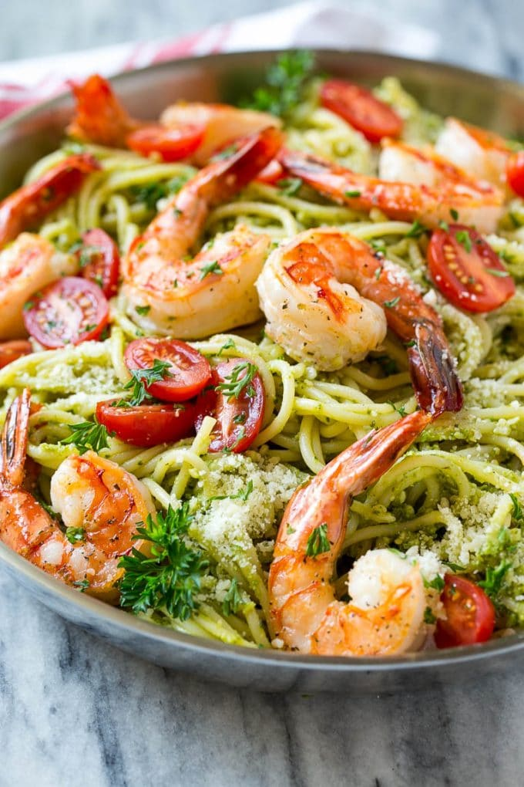
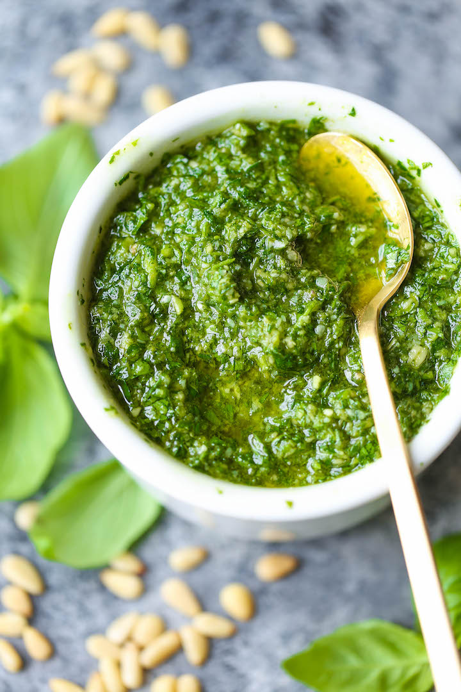

# Pasta with shrimps in Pesto sauce

It doesn’t get much simpler than this shrimp pesto pasta! The whole thing is ready in about 20 minutes, you can’t beat that! Try the classic spaghetti with green sauce pesto! Easy to cook, but full of flavor! Hope this becomes your favourite recipe too!

## What Is Pesto?

Originally from Genoa, Italy, pesto traces its name to the Italian word "pestare," which means "to crush or pound." For hundreds of years, pesto was made by pounding the ingredients in a mortar and pestle. It dates back from Roman times when Genoans would crush walnuts with herbs and garlic. The most popular variety of pesto now is made by "crushing" basil, garlic, pine nuts, olive oil and some hard cheese in a food processor or blender. It's fun to use a mortar and pestle, but the modern way is much easier.

###What do you need to buy to cook your favorite food?

* Shrimps
* Noodles
* Water
* A big jug of fresh basil
* Parmesan
* Pine nuts
* Olive oil
* Cream
* Garlic
* Onion
* Salt
* Cherry tomatoes

###How to cook your favorite food?

1. Bring a large pot of salted water to a boil and cook the pasta according to package directions.
2. Meanwhile, heat the olive oil in a large pan over high heat. Add the shrimp and cook for 2-4 minutes or until shrimp are just pink and opaque.
3. Add onion and cook about 3 minutes, or until onions are soft. Turn off the heat.
4. To make the pesto, combine basil, 2 cloves of garlic, 1 tablespoon of pine nuts and Parmesan in the bowl of a food processor, season with salt to taste, add olive oil. Pulse several times until creamy.
5. Add the cooked Pesto sauce to the pan with the shrimp. Stir in the cream.
6. Chili for spice can be added now if desired.
7. Drain the pasta and add it to the pan. Add the cherry tomatoes.
8. Serve with grated Parmesan cheese. Garnish with basil leaves if desired.